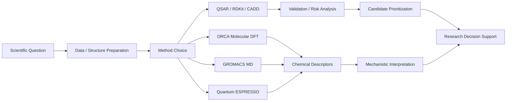

# Evangelia Mitropoulou

Computational chemist and cheminformatics-oriented researcher with hands-on experience across CADD/QSAR, RDKit molecular-data workflows, molecular DFT, molecular dynamics, periodic DFT, Python automation and Linux-based research computing.

This portfolio is a curated technical record of real computational chemistry work. It is organized for computational drug discovery, cheminformatics, and molecular-science roles: each project emphasizes the scientific question, method choices, validation logic, and the evidence produced by the workflow.

## Portfolio Highlights

- **Computational drug discovery:** model-risk-aware EGFR QSAR and drug-likeness-aware prioritization pipeline using ChEMBL, RDKit, scikit-learn, scaffold splits, and applicability-domain analysis.
- **Molecular DFT:** ORCA workflows for phosphorus-containing flame-retardant candidates, conformer ranking, vibrational analysis, bond metrics, and mechanistic interpretation.
- **Molecular dynamics:** GROMACS simulations of isotactic polypropylene melt behavior, including staged equilibration, production MD, and thermodynamic analysis.
- **Periodic materials modeling:** Quantum ESPRESSO workflows for crystalline and inorganic systems.

## Selected Projects

### 1. [EGFR QSAR / Drug-Likeness-Aware CADD Pipeline](./projects/egfr-cadd-qsar-admet/README.md)
A reproducible cheminformatics project for EGFR inhibitor-like compound prioritization. The workflow curates ChEMBL IC50 data, computes RDKit descriptors and Morgan fingerprints, trains baseline QSAR models, compares random versus scaffold splits, analyzes applicability domain, and ranks candidates with explicit model-risk labels.

**Relevant capabilities:** ChEMBL, RDKit, QSAR, scaffold split, applicability domain, physicochemical filtering, model-risk communication.

### 2. [Flame-Retardant Materials Case Study](./projects/flame-retardants/README.md)
Computational analysis of phosphorus-based flame-retardant candidates, linking DFT-derived metrics to decomposition behavior, char formation, and substituent effects.

**Relevant capabilities:** ORCA, molecular DFT, conformer ranking, vibrational analysis, bond metrics, structure-property interpretation.

### 3. [Polymer Molecular Dynamics Case Study](./projects/polymer-md/README.md)
GROMACS workflow for isotactic polypropylene melt simulations, including staging, run strategy, and representative thermodynamic outputs.

**Relevant capabilities:** GROMACS, polymer melt simulation, staged equilibration, production MD, thermodynamic analysis.

### 4. [Periodic DFT Case Study](./projects/periodic-dft/README.md)
Quantum ESPRESSO workflows for inorganic and crystalline materials, demonstrating periodic structure preparation, relaxation, and solid-state modeling practice.

**Relevant capabilities:** Quantum ESPRESSO, periodic DFT, CIF-derived structures, relaxation/SCF workflows, MPI-oriented execution.

## Technical Stack

- **Cheminformatics / CADD:** RDKit, ChEMBL data curation, QSAR, molecular descriptors, Morgan fingerprints, Tanimoto similarity, scaffold split, physicochemical filtering.
- **Machine learning:** scikit-learn, Ridge regression, Random Forest, Gradient Boosting, cross-validation, model-risk analysis.
- **Quantum chemistry:** ORCA, molecular DFT, vibrational analysis, bond metrics, and electronic-structure interpretation.
- **Molecular simulation:** GROMACS, polymer melt MD, thermodynamic analysis.
- **Periodic DFT:** Quantum ESPRESSO.
- **Programming and research computing:** Python, pandas, NumPy, Matplotlib, Bash, Linux, Git/GitHub, SLURM job scripts.

## Workflow Map



## Repository Structure

```text
portfolio/
├── assets/
│   ├── figures/
│   └── images/
├── docs/
└── projects/
    ├── egfr-cadd-qsar-admet/
    ├── flame-retardants/
    ├── periodic-dft/
    └── polymer-md/
```

## Positioning

Eva's background is strongest where molecular science, computation, and experimental chemistry meet. This portfolio presents that foundation while making the computational drug-discovery skills explicit: molecular data curation, RDKit workflows, QSAR validation, applicability-domain thinking, and transparent candidate prioritization.
