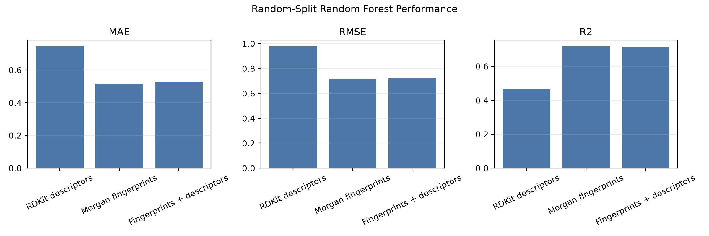
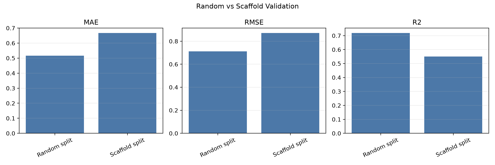
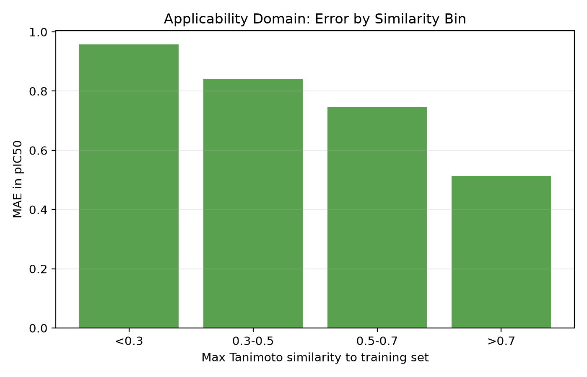

# EGFR QSAR / Model-Risk-Aware CADD Pipeline

## Public Portfolio Claim Boundary

This project is presented as a retrospective EGFR QSAR/CADD baseline. It demonstrates ChEMBL curation, RDKit descriptors/fingerprints, baseline modeling, and random-versus-scaffold validation. It is not a production-grade predictor, prospective validation study, clinical-utility claim, or binding-mechanism claim.

## Project Focus

This project is a reproducible cheminformatics and CADD case study for prioritizing EGFR inhibitor-like small molecules from public ChEMBL bioactivity data. It combines activity curation, RDKit molecular representations, baseline QSAR modeling, scaffold-aware validation, applicability-domain analysis, and drug-likeness-aware candidate ranking.

The goal is to show a realistic, auditable workflow that asks whether a model is useful, where it is risky, and how those risks should affect candidate prioritization.

## At A Glance

| Result | Value |
| --- | ---: |
| Raw ChEMBL EGFR IC50 rows downloaded | 26,600 |
| Unique cleaned molecules | 10,834 |
| Model-ready molecules | 10,593 |
| Best random-split QSAR model | Morgan fingerprint Random Forest |
| Best random-split performance | MAE 0.516, RMSE 0.712, R2 0.719 |
| Scaffold-split performance | MAE 0.667, RMSE 0.871, R2 0.550 |
| Scaffold GroupKFold performance | MAE 0.618 +/- 0.037, R2 0.616 +/- 0.034 |
| Applicability-domain signal | MAE drops from 0.957 to 0.514 as similarity increases |
| Diverse top-20 ranking | 20 unique scaffolds, 17 low-risk, 19 Lipinski-clean |

## Scientific Question

Public bioactivity datasets can make QSAR models look stronger than they are when similar analogs leak across train/test splits or when heterogeneous assay values are treated as perfectly comparable. This project asks:

> Can an EGFR prioritization workflow be built in a way that is reproducible, chemically interpretable, and honest about model generalization risk?

## Workflow

```text
ChEMBL EGFR IC50 records
-> clean exact nM IC50 values
-> aggregate duplicate molecules by median pIC50
-> calculate RDKit descriptors and Morgan fingerprints
-> run EDA and broad model-ready filters
-> train descriptor, fingerprint, and combined QSAR baselines
-> compare random split, scaffold split, and cross-validation
-> analyze applicability domain with Tanimoto similarity
-> rank compounds using predicted potency, drug-likeness proxies, and model-risk penalties
```

## Dataset Summary

- Target: EGFR, ChEMBL target `CHEMBL203`
- Raw ChEMBL IC50 activity rows downloaded: 26,600
- Unique cleaned molecules after exact nM IC50 curation: 10,834
- Model-ready molecules after broad sanity filters: 10,593
- Activity target: median pIC50 per molecule
- Molecular features: RDKit descriptors and Morgan fingerprints

The important point for portfolio review: this is large enough to be a real QSAR exercise, but still small enough to be reproducible on a normal workstation.

## Headline Results

### Feature-set comparison

| Feature set | Model | MAE | RMSE | R2 |
| --- | --- | ---: | ---: | ---: |
| RDKit descriptors | Random Forest | 0.745 | 0.979 | 0.468 |
| Morgan fingerprints | Random Forest | 0.516 | 0.712 | 0.719 |
| Fingerprints + descriptors | Random Forest | 0.526 | 0.719 | 0.713 |

Morgan fingerprints captured EGFR-relevant substructure information better than broad physicochemical descriptors alone.



### Random split vs scaffold split

| Validation | Feature set | MAE | RMSE | R2 |
| --- | --- | ---: | ---: | ---: |
| Random split | Morgan fingerprints | 0.516 | 0.712 | 0.719 |
| Scaffold split | Morgan fingerprints | 0.667 | 0.871 | 0.550 |

The random split was optimistic. The scaffold split gave a harder estimate of generalization to new chemical cores.



### Cross-validation

| Validation scheme | MAE | RMSE | R2 |
| --- | ---: | ---: | ---: |
| Random KFold | 0.511 +/- 0.009 | 0.703 +/- 0.008 | 0.724 +/- 0.006 |
| Scaffold GroupKFold | 0.618 +/- 0.037 | 0.823 +/- 0.042 | 0.616 +/- 0.034 |

The model was stable under random cross-validation, but performance dropped under scaffold-aware validation.

## Applicability Domain

For each held-out scaffold-CV molecule, the workflow calculated the maximum Morgan-fingerprint Tanimoto similarity to training molecules. Prediction error decreased as similarity to the training chemistry increased.

| Max Tanimoto to training set | Count | MAE | RMSE |
| --- | ---: | ---: | ---: |
| <0.3 | 149 | 0.957 | 1.199 |
| 0.3-0.5 | 792 | 0.842 | 1.072 |
| 0.5-0.7 | 3,372 | 0.745 | 0.947 |
| >0.7 | 6,280 | 0.514 | 0.697 |



This result is used directly in the ranking step through model-risk categories and penalties.

## Candidate Ranking

The final candidate ranking uses only information that would be available in a prospective-style prioritization table:

```text
final_score = predicted_pIC50 + QED - model_risk_penalty - property_penalty
```

The ranking considers:

- predicted EGFR activity as pIC50
- QED drug-likeness score
- Lipinski-style violations
- TPSA, rotatable bonds, and low-QED flags
- max Tanimoto similarity to training chemistry
- model-risk category: low, medium, high, or very_high

Summary of final ranking:

- Ranked molecules: 10,593
- Top 20 predicted pIC50 range: 8.795-10.029
- Diverse top 20 predicted pIC50 range: 8.689-10.029
- Diverse top 20 unique scaffolds: 20
- Diverse top 20 model risk: 17 low-risk, 3 medium-risk
- Lipinski-clean diverse top 20: 19/20

See [`reports/top_20_diverse_candidates.md`](./reports/top_20_diverse_candidates.md) for the readable diverse top-20 table.

## Included Artifacts

```text
egfr-cadd-qsar-admet/
├── code/
│   ├── fetch_egfr_ic50_raw.py
│   ├── clean_egfr_ic50.py
│   ├── calculate_descriptors.py
│   ├── train_descriptor_baseline.py
│   ├── train_fingerprint_baseline.py
│   ├── train_combined_baseline.py
│   ├── train_scaffold_split.py
│   ├── cross_validate_qsar.py
│   ├── analyze_applicability_domain.py
│   ├── rank_candidates.py
│   └── create_final_summary.py
├── figures/
├── results/
├── reports/
├── data-note.md
├── requirements.txt
└── README.md
```

The full raw and processed ChEMBL datasets are intentionally not included in this portfolio copy. See [`data-note.md`](./data-note.md).

## Key Reports and Tables

- [`reports/project_results_summary.md`](./reports/project_results_summary.md)
- [`reports/top_20_diverse_candidates.md`](./reports/top_20_diverse_candidates.md)
- [`results/fingerprint_baseline_metrics.csv`](./results/fingerprint_baseline_metrics.csv)
- [`results/scaffold_fingerprint_metrics.csv`](./results/scaffold_fingerprint_metrics.csv)
- [`results/cross_validation_metrics.csv`](./results/cross_validation_metrics.csv)
- [`results/applicability_domain_summary.csv`](./results/applicability_domain_summary.csv)
- [`results/top_20_diverse_candidates.csv`](./results/top_20_diverse_candidates.csv)

## How To Reproduce

The working project used Python, RDKit, pandas, scikit-learn, matplotlib, and the official ChEMBL Python client. RDKit is best installed from `conda-forge`.

```bash
conda create -n egfr-cadd python=3.11 -y
conda activate egfr-cadd
conda install -c conda-forge rdkit pandas numpy scikit-learn matplotlib jupyter -y
pip install chembl_webresource_client
```

Then run the scripts in `code/` in workflow order. In the original working repo these files lived in `src/`; they are stored under `code/` here for portfolio readability.

```bash
python code/fetch_egfr_ic50_raw.py
python code/clean_egfr_ic50.py
python code/calculate_descriptors.py
python code/eda_summary.py
python code/filter_model_ready.py
python code/train_descriptor_baseline.py
python code/train_fingerprint_baseline.py
python code/train_combined_baseline.py
python code/train_scaffold_split.py
python code/cross_validate_qsar.py
python code/analyze_applicability_domain.py
python code/rank_candidates.py
python code/create_final_summary.py
```
