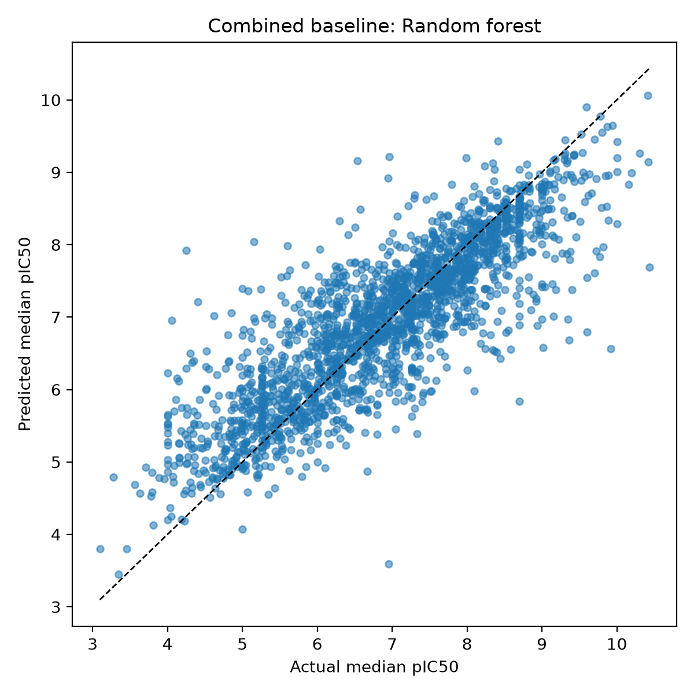
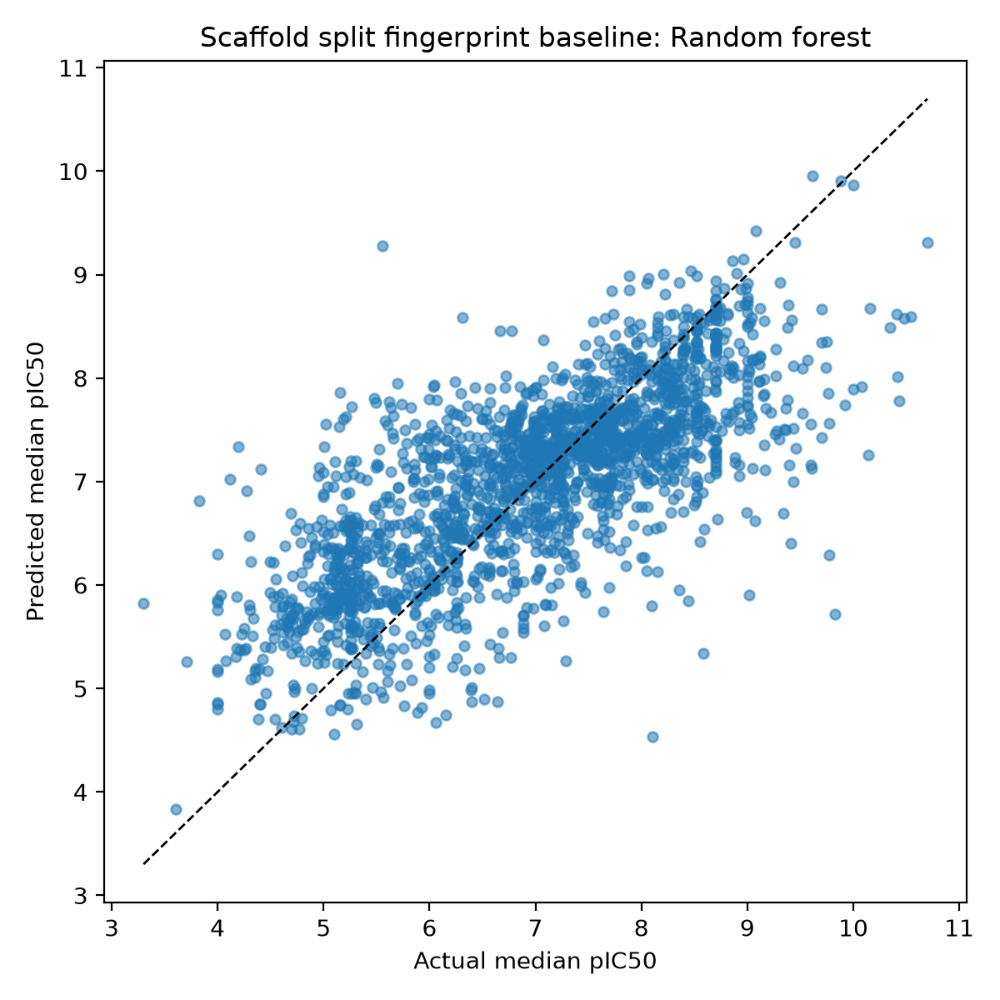
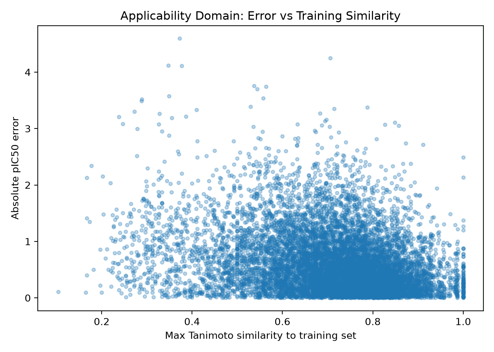

# EGFR QSAR / Drug-Likeness-Aware CADD Pipeline

## Project Focus

This case study demonstrates a model-risk-aware cheminformatics workflow for prioritizing EGFR inhibitor-like molecules from public ChEMBL bioactivity data. The goal is not to claim experimental drug-discovery success, but to show a realistic early-stage CADD workflow: clean public assay data, build reproducible molecular features, compare validation schemes, and rank candidates with explicit applicability-domain warnings.

## Problem

Public bioactivity datasets can produce optimistic QSAR results if duplicate records, inconsistent activity units, scaffold leakage, and chemical-domain limits are not handled carefully. This project asks:

> Can an EGFR inhibitor prioritization pipeline be built in a way that is reproducible, transparent, and honest about model generalization risk?

## What Was Built

- ChEMBL EGFR IC50 data retrieval and curation pipeline.
- IC50-to-pIC50 conversion, duplicate aggregation, SMILES validation, and descriptor calculation.
- RDKit descriptor and Morgan fingerprint feature sets.
- Baseline QSAR regressors using Ridge, Random Forest, and Gradient Boosting models.
- Random split, cross-validation, and Bemis-Murcko scaffold split evaluation.
- Applicability-domain analysis using Tanimoto similarity to training compounds.
- Physicochemical filtering and candidate ranking using predicted activity, QED, molecular weight, LogP, TPSA, rotatable bonds, and model-risk penalties.

## Dataset Summary

- Source target: EGFR, ChEMBL target `CHEMBL203`.
- Starting curated descriptor table: 10,834 compounds.
- Model-ready set after physicochemical filtering: 10,593 compounds.
- Activity target: median pIC50 after IC50 normalization and duplicate aggregation.

## Representative Model Results

| Feature set / validation | Best baseline model | MAE | RMSE | R2 |
| --- | --- | ---: | ---: | ---: |
| Morgan fingerprints, random split | Random Forest | 0.516 | 0.712 | 0.719 |
| Combined descriptors + fingerprints, random split | Random Forest | 0.526 | 0.719 | 0.713 |
| Morgan fingerprints, scaffold split | Random Forest | 0.667 | 0.871 | 0.550 |

The drop from random split to scaffold split is the key scientific point: model performance is strongest for chemically similar compounds and weaker for novel scaffold regions, which is exactly the kind of risk a CADD portfolio should surface rather than hide.

## Applicability-Domain Finding

Prediction error increased as compounds became less similar to the training domain:

| Max Tanimoto to training set | Count | MAE | RMSE |
| --- | ---: | ---: | ---: |
| <0.3 | 149 | 0.957 | 1.199 |
| 0.3-0.5 | 792 | 0.842 | 1.072 |
| 0.5-0.7 | 3,372 | 0.745 | 0.947 |
| >0.7 | 6,280 | 0.514 | 0.697 |

This is used directly in candidate ranking through model-risk labels and penalties.

## Included Technical Artifacts

```text
egfr-cadd-qsar-admet/
├── code/
│   ├── fetch_egfr_ic50_raw.py
│   ├── clean_egfr_ic50.py
│   ├── calculate_descriptors.py
│   ├── train_fingerprint_baseline.py
│   ├── train_descriptor_baseline.py
│   ├── train_combined_baseline.py
│   ├── train_scaffold_split.py
│   ├── cross_validate_qsar.py
│   ├── analyze_applicability_domain.py
│   └── rank_candidates.py
├── figures/
│   ├── combined_predicted_vs_actual.png
│   ├── scaffold_fingerprint_predicted_vs_actual.png
│   ├── error_vs_max_tanimoto.png
│   ├── model_ready_pic50_vs_logp.png
│   └── model_ready_pic50_vs_qed.png
├── results/
│   ├── fingerprint_baseline_metrics.csv
│   ├── combined_baseline_metrics.csv
│   ├── scaffold_fingerprint_metrics.csv
│   ├── cross_validation_metrics.csv
│   ├── applicability_domain_summary.csv
│   ├── top_20_candidates.csv
│   └── top_20_diverse_candidates.csv
└── reports/
    ├── eda_summary.txt
    └── model_ready_summary.txt
```

## Selected Visual Evidence

### Random-split baseline behavior



### Scaffold-split generalization check



### Applicability-domain error trend



## Why This Matters For Drug-Discovery Roles

This project shows practical skills that map directly onto computational drug-discovery and cheminformatics work:

- careful handling of public bioactivity data rather than blindly training on downloaded tables
- RDKit-based molecular representation and descriptor engineering
- baseline QSAR modeling with explicit validation choices
- scaffold-aware model-risk interpretation
- candidate prioritization that balances predicted activity, chemical properties, and applicability domain
- reproducible Python workflow organization suitable for review by scientists and engineers

## Limitations

The ranked molecules are computationally prioritized hypotheses, not validated drug candidates. The workflow does not include docking, free-energy calculations, pharmacokinetic modeling, toxicity modeling, or experimental validation. The value of the project is the disciplined CADD workflow and model-risk communication.
