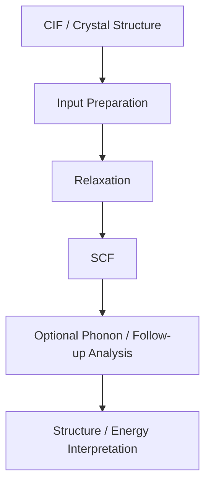

# Periodic DFT Case Study

## Project Focus

This case study shows periodic density functional theory workflows built around Quantum ESPRESSO for solid-state and crystalline materials systems. It complements the molecular ORCA work by demonstrating comfort with periodic modeling and materials-relevant electronic-structure calculations.

## Problem Space

Molecular DFT alone is not enough for many materials problems. Periodic systems require different structure preparation, different convergence logic, and different execution patterns. This project demonstrates that transition.

## What Was Done

- Prepared crystalline structures from CIF-derived inputs.
- Built Quantum ESPRESSO input files for relaxation and SCF workflows.
- Used MPI-oriented execution for periodic calculations.
- Maintained a consistent project layout for pseudopotentials, structures, inputs, outputs, and relaxed geometries.
- Documented execution and reinstallation procedures in a reproducible way.

## Included Technical Artifacts

```text
periodic-dft/
├── code/
│   ├── cif_to_qe_structure.py
│   └── qe_restarter.sh
└── inputs/
    ├── a_berlinite_vc_qe.in
    ├── berlinite_ph.in
    └── A_AlPO3_3_vc_qe.in
```

### What Is Included

- `inputs/a_berlinite_vc_qe.in`
  Representative variable-cell relaxation input for a periodic crystal system.
- `inputs/berlinite_ph.in`
  Example phonon-related follow-up calculation input.
- `inputs/A_AlPO3_3_vc_qe.in`
  Larger periodic input demonstrating a more detailed QE setup.
- `code/cif_to_qe_structure.py`
  ASE-based helper for converting CIF-derived structures into a form suitable for QE workflows.
- `code/qe_restarter.sh`
  Bash utility for restarting or recovering longer-running periodic calculations.

## Workflow



## Why This Matters

This project expands the portfolio from molecular chemistry into computational materials science:

- periodic DFT competence
- crystalline structure handling
- materials-oriented simulation thinking
- HPC-aware execution patterns

## Representative Systems

- Berlinite
- Alpha-cristobalite
- AlPO-based systems
- other CIF-driven inorganic structures

## Representative Execution Pattern

```bash
export OMP_NUM_THREADS=1 MKL_NUM_THREADS=1
mpirun -np 32 pw.x -npool 4 -ndiag 2 -in a_berlinite_vc_qe.in > a_berlinite_vc_qe.out
```

## Core Competencies Demonstrated

- Executing periodic materials simulations beyond single-molecule electronic structure
- Designing organized, reproducible solid-state modeling workflows
- Translating chemistry-driven questions into materials-driven computational models
