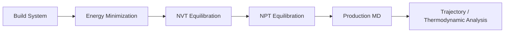
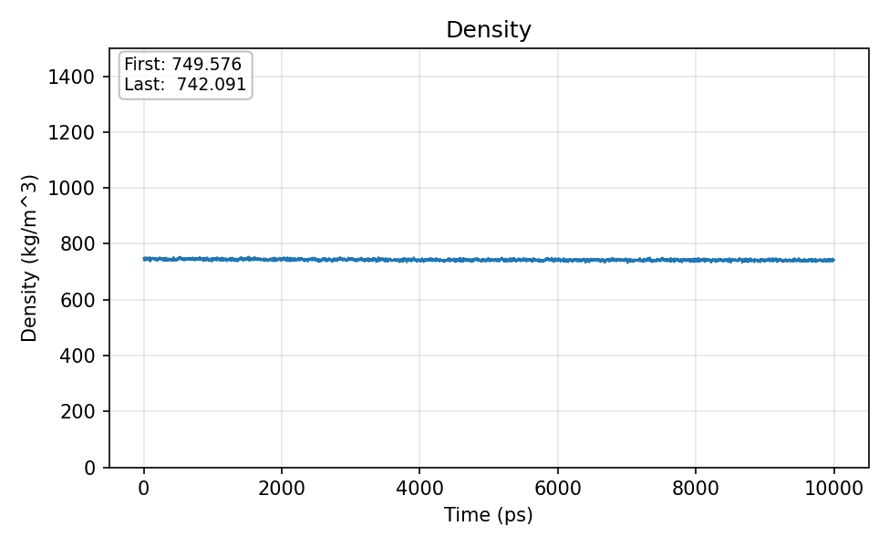
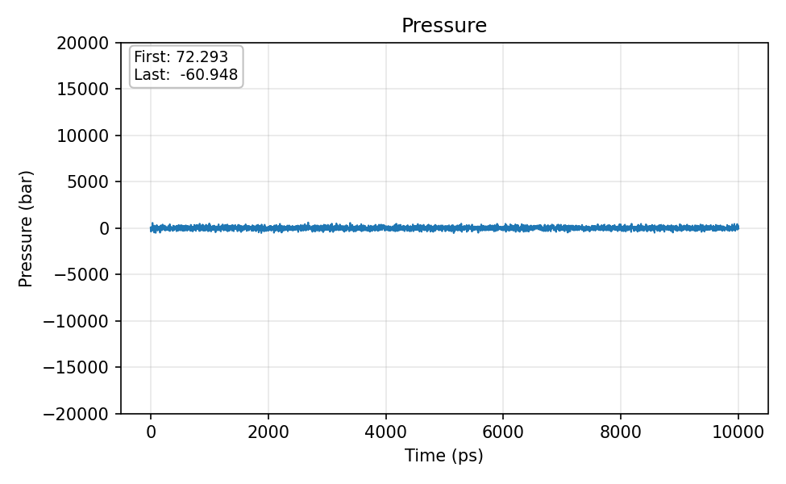

# Polymer Molecular Dynamics Case Study

## Public Portfolio Flagship Layer

This project is now used as the public-facing entry point for polymer-filler molecular simulation evidence. The flagship framing focuses on polypropylene/brucite interface modeling, coated versus uncoated aggregate contact and interaction-energy summaries, force-field-aware limitations, and reproducible cached artifacts under `reports/` and `figures/`.

The public interpretation is limited to computational evidence: surface coating reduced direct PP-brucite contact and shifted interaction toward the coating layer in available aggregate MD outputs. It is not a standalone property-prediction claim.

## Project Focus

This case study showcases an end-to-end molecular dynamics workflow for an isotactic polypropylene melt using GROMACS and the L-OPLS force field. The project is useful as a portfolio piece because it demonstrates practical simulation staging, reproducibility, and interpretation of thermodynamic outputs in a polymer context.

## System

- isotactic polypropylene melt
- 75 chains x 160 monomers per chain
- cubic simulation box
- L-OPLS force field
- elevated-temperature run strategy for melt behavior

## Workflow



## What Was Done

- Organized the simulation into clear stages: build, minimization, NVT, NPT, and production.
- Preserved reusable topology and force-field structure for portability and reproducibility.
- Generated thermodynamic outputs including density, pressure, temperature, volume, and box-dimension traces.
- Documented transfer and restart logic so simulations can be resumed or migrated cleanly.

## Included Technical Artifacts

```text
polymer-md/
├── analysis/
│   └── data_extract.sh
├── figures/
└── inputs/
    ├── em.mdp
    ├── nvt.mdp
    ├── npt.mdp
    ├── md.mdp
    └── topol.top
```

## Representative Thermodynamic Outputs

The production trajectory was summarized through standard GROMACS energy and box observables. These traces are included as compact evidence that the workflow produced interpretable simulation outputs rather than only setup files.







## Core Competencies Demonstrated

- Designing and executing production-scale molecular dynamics workflows for polymer systems
- Managing simulation continuity, checkpoints, and reproducibility across HPC environments
- Processing raw simulation trajectories into interpretable thermodynamic and structural outputs
