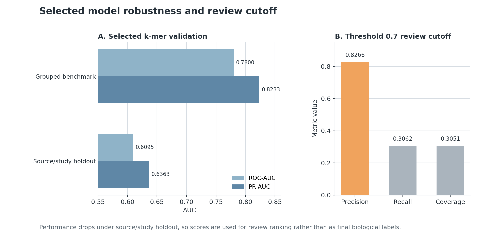

# Antibody Prioritization

This project builds an antibody sequence ML pipeline using public SARS-CoV-2 antibody records. I curated labeled public records, trained ML models to learn patterns associated with neutralising versus non-neutralising sequences, and then used the trained scoring workflow to prioritize existing OAS antibody records that look most similar to known neutralizing antibodies. The goal is finding existing records that may be worth closer expert review.

## Table of Contents

- [Project Workflow](#project-workflow)
- [Model Benchmarking and Selection](#model-benchmarking-and-selection)
- [Main Results](#main-results)
  - [OAS Background Controls](#oas-background-controls)
- [Scope and Limits](#scope-and-limits)
- [Reproduce](#reproduce)
- [Useful Files](#useful-files)


## Project Workflow

<p align="center">
  
</p>

The project starts with CoV AbDab SARS CoV 2 entries: heavy/VHH and light chain sequences are cleaned, missing placeholders are standardised, amino acid strings are checked, and each record is linked to its source and target region metadata when available.

Neutralisation labels are taken directly from the public record fields. Records reported as neutralising against SARS CoV 2 form the positive class, records reported as not neutralising form the negative class, and conflicting records are kept separate rather than forced into the supervised benchmark.

After curation, the data is organised into working tables. The strict labelled table is used for model benchmarking, grouped validation, source holdout, calibration, and model selection. The broader prepared table keeps records with missing or conflicting labels so they can still be scored and reviewed. A paired annotated subset is used separately for CDR and region based comparisons.

| Table | Rows | Used for |
|---|---:|---|
| Strict labelled ML table | 5,573; label 0 = 2,292, label 1 = 3,281 | Supervised benchmarking, source/study holdout, calibration, model selection, and sequence space summaries. |
| Broader prepared table | 11,748 | Existing record scoring, missing/conflicting label review categories, and shortlist construction. |
| Paired annotated subset | 5,092 | CDR and region comparisons on rows with paired chain annotation. |

For modelling, each antibody record is represented as heavy/VHH sequence, paired heavy-light sequence when available, CDR/region sequence, or combined whole-pair plus region sequence. These representations are evaluated separately because not all records contain the same chain fields or region annotations.

The main baseline uses amino acid k mer TF IDF features with logistic regression and class weights. Pretrained antibody representations, including AbLang2 and IgBERT based experiments, are evaluated later as benchmark comparisons rather than assumed to be better.

The OAS analysis is kept separate from the neutralisation benchmark. OAS records are treated as unknown target antibody background, and existing OAS records are ranked using model score and similarity to curated positive CoV AbDab records.

## Model Benchmarking and Selection

The main supervised benchmark compared sequence models on the strict labelled CoV AbDab table. The simplest model used amino acid k mer TF IDF features with logistic regression, while the pretrained model experiments tested antibody language model representations, including AbLang2 embeddings and IgBERT fine tuning.

The first comparison showed that the whole pair k mer model and IgBERT fine tuning were close. The k mer model reached ROC AUC 0.7800 and PR AUC 0.8233, while the best single IgBERT fine tuning run reached ROC AUC 0.7695 and PR AUC 0.8317. IgBERT raised PR AUC slightly, but did not raise ROC AUC.

<p align="center">
  
</p>

This same-subset benchmark shows why the first comparison was close, but not a clear win for IgBERT on both primary metrics.

Because this was not a clear win, I ran additional checks instead of selecting the fine-tuned IgBERT model from one strong run. A five seed IgBERT fine tuning check gave lower mean performance, with ROC AUC 0.7443 and PR AUC 0.8151. Later IgBERT variants also did not consistently outperform the k mer baseline.

<p align="center">
  
</p>

The seed-averaged follow-up supports retaining the k mer model rather than selecting the fine-tuned IgBERT model from one strong run.

The final broad scorer was therefore the whole pair k mer model. It was retained because it performed strongly on the full strict labelled dataset, remained simpler and easier to reproduce, and no same subset pretrained alternative clearly raised both primary metrics.

I then tested the selected model under stricter validation. Grouped validation reduced sequence family leakage, while source and study holdout tested whether performance survived publication level shifts. The source holdout result was lower, with weighted ROC AUC 0.6095 and weighted PR AUC 0.6363, so model scores are treated as ranking signals for review rather than final biological labels.

Calibration and threshold analysis were used after model selection. The threshold 0.7 setting selected fewer records but with higher precision, making it useful for focused review lists. This is the score cutoff used to discuss high confidence review behaviour, not a claim that the score is a calibrated probability.

<p align="center">
  
</p>

## Main Results

| Area | Result | Interpretation |
|---|---:|---|
| Strict labelled dataset | 5,573 records; label 0 = 2,292, label 1 = 3,281 | Main supervised benchmark table. |
| Selected broad scorer | Whole pair k mer TF IDF logistic regression | Retained after AbLang2, IgBERT, five seed, and source holdout checks. |
| Main grouped benchmark | ROC AUC 0.7800, PR AUC 0.8233 | The selected model separates many reported neutralising and non neutralising records under grouped validation. |
| IgBERT five-seed check | mean ROC AUC 0.7443, mean PR AUC 0.8151 | IgBERT did not consistently beat the k mer baseline across seeds. |
| Source/study holdout | weighted ROC AUC 0.6095, weighted PR AUC 0.6363 | Performance drops when whole source groups are held out. |
| Threshold 0.7 | precision 0.8266, recall 0.3062, coverage 0.3051 | Selective cutoff for focused review lists. |
| Broader CoV AbDab shortlist | 23 records | Compact review list from broader records with missing or conflicting labels. |
| OAS existing record scoring | 17,882 OAS rows scored; top 25 diverse records | Existing OAS records ranked with model score and similarity to curated positive records. |

### OAS Background Controls

Broad and matched OAS retrieval were used to check how separable curated CoV AbDab records were from OAS unknown target antibody background. These are background retrieval diagnostics, not neutralisation benchmarks.

| Control | Result |
|---|---:|
| Broad OAS retrieval | ROC AUC 0.9921, PR AUC 0.9897 |
| Matched OAS retrieval | ROC AUC 0.9911, PR AUC 0.9893 |

## Reproduce

The repository includes generated reports and machine-readable metrics. Some raw and processed sequence tables are local artifacts and may not be committed.

Lightweight report refresh:

```bash
python -m pip install -r requirements.txt
make reproduce-small
```

Direct script:

```bash
bash scripts/reproduce_final_reports.sh
```

`make report` runs the same report script. OAS retrieval steps are skipped if local standardized OAS data is missing. Optional pretrained model scripts use `requirements-lm.txt`.

## Useful Files

- `reports/final_project_report.md`
- `reports/model_registry.md`
- `reports/oas_existing_record_shortlist_report.md`
- `docs/DATA_CARD.md`
- `docs/MODEL_CARD.md`
- `scripts/reproduce_final_reports.sh`
- `Makefile`

Machine-readable summaries are under `reports/metrics/`.
