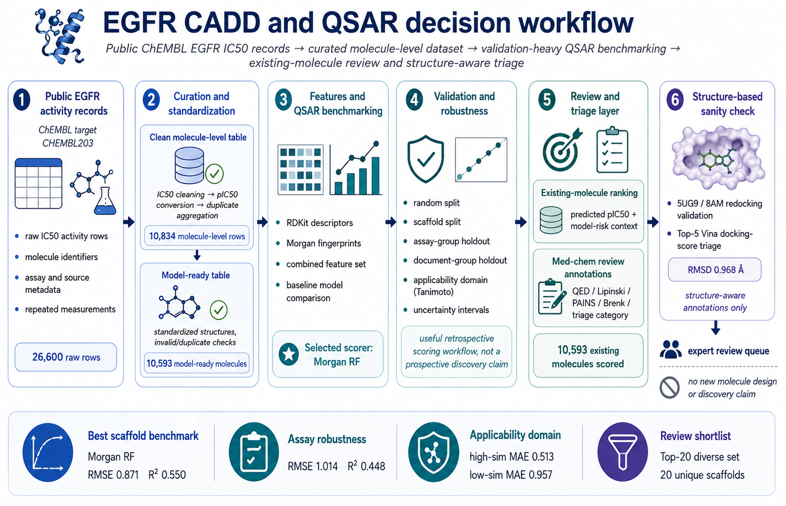
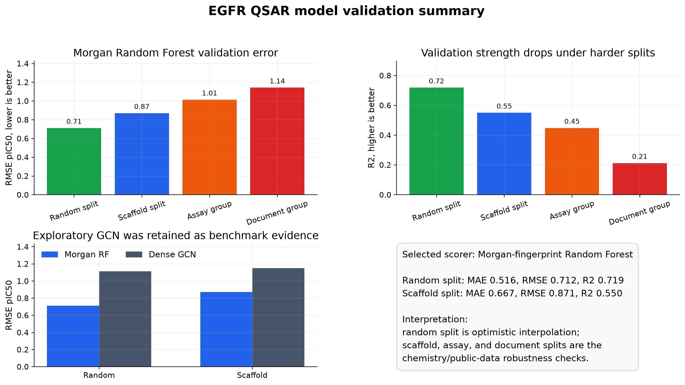
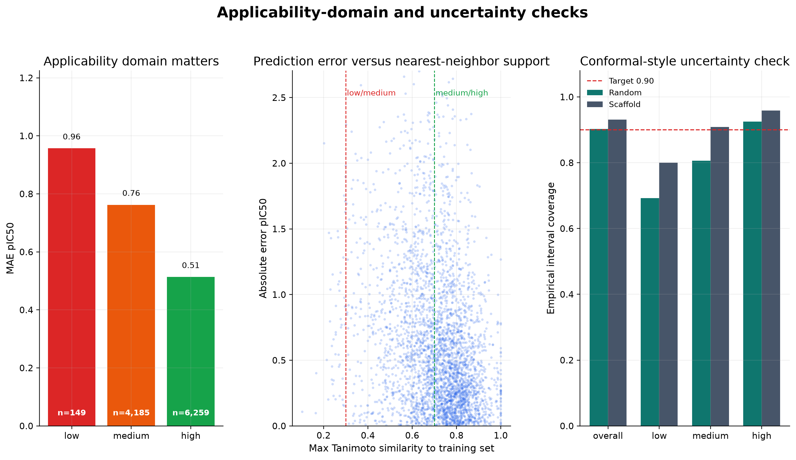
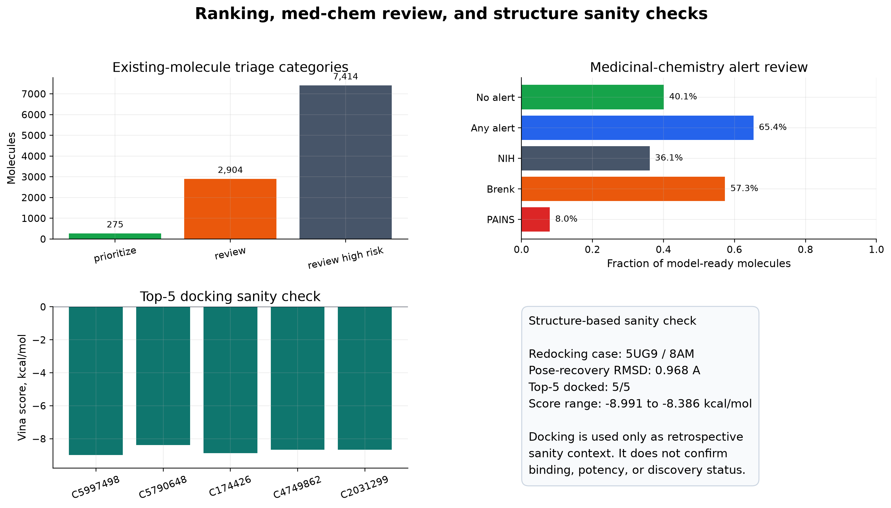

# EGFR CADD and QSAR Decision Workflow

This project builds an EGFR CADD/QSAR workflow using public ChEMBL IC50 records. I curated molecule-level activity data, standardized molecules, generated RDKit descriptor and Morgan fingerprint features, benchmarked QSAR models under multiple validation settings, and used the trained scoring workflow to review existing EGFR inhibitor-like records.

This project tests how much useful modeling can be done from public EGFR IC50 data, while also checking where the model becomes unreliable.

## Table of Contents

* [Project Workflow](#project-workflow)
* [Model Benchmarking and Selection](#model-benchmarking-and-selection)
* [Main Results](#main-results)
  * [Applicability Domain and Uncertainty Checks](#applicability-domain-and-uncertainty-checks)
  * [Drug-Likeness and Alert Review](#drug-likeness-and-alert-review)
  * [Structure-Based Sanity Check](#structure-based-sanity-check)
* [Scope and Limits](#scope-and-limits)
* [Reproduce](#reproduce)
* [Useful Files](#useful-files)

## Project Workflow

<p align="center">
  
</p>

The workflow starts from public ChEMBL activity records for EGFR target `CHEMBL203`. I kept IC50 measurements, cleaned activity units and values, converted the usable records to pIC50, and aggregated repeated measurements into a molecule-level activity table.

The model-ready dataset is built after molecular standardization. Molecules are standardized, checked for invalid structures and duplicates, and then represented with RDKit physicochemical descriptors, Morgan fingerprints, and combined feature sets. These features are aligned to the molecule-level pIC50 labels before model training.

The final scoring workflow uses the selected QSAR baseline to rank existing molecules already present in the curated EGFR activity table. The ranking table keeps the model prediction together with applicability-domain context, uncertainty interval fields, QED/Lipinski review features, PAINS/Brenk alert flags, and triage categories for expert review.

| Stage | Output | Role |
|---|---:|---|
| Public target | `CHEMBL203` | EGFR target used for activity retrieval. |
| Raw IC50 activity rows | 26,600 | Starting ChEMBL activity records before molecule-level aggregation. |
| Clean molecule-level pIC50 rows | 10,834 | Curated activity table after IC50 cleaning and aggregation. |
| Model-ready molecules | 10,593 | Standardized molecules with labels and generated features. |
| Feature families | RDKit descriptors, Morgan fingerprints, combined features | QSAR model inputs. |
| Final ranking table | 10,593 existing molecules | Retrospective review table. |

## Model Benchmarking and Selection

The models were tested with both random and scaffold splits. The random split measures performance when similar molecules may appear in both training and test data. The scaffold split is stricter because it tests whether the model can generalize to different chemical scaffold families.

I also ran assay-group and document-group splits to test robustness against public-data context. These splits hold out assay or publication groups and therefore better reflect the heterogeneity of public IC50 records.

The selected practical baseline is a Morgan fingerprint Random Forest. It was the strongest practical scorer across the final benchmark reports, including the stricter scaffold split. The GCN model is kept as an exploratory benchmark, not the selected scorer, because it did not improve over the Morgan Random Forest in this run.

<p align="center">
  
</p>

## Main Results

| Area | Result | Interpretation |
|---|---:|---|
| Raw ChEMBL IC50 rows | 26,600 | Starting public EGFR activity records. |
| Clean molecule-level pIC50 rows | 10,834 | Curated molecule-level table after IC50 cleaning and aggregation. |
| Model-ready molecules | 10,593 | Standardized labeled molecules used for features, validation, and ranking. |
| Best random split | Morgan RF: MAE 0.516, RMSE 0.712, R2 0.719 | Optimistic interpolation benchmark. |
| Best scaffold split | Morgan RF: MAE 0.667, RMSE 0.871, R2 0.550 | Harder chemistry-aware validation. |
| Assay-group split | MAE 0.796, RMSE 1.014, R2 0.448, group overlap 0 | Public-assay robustness check. |
| Document-group split | MAE 0.881, RMSE 1.143, R2 0.212, group overlap 0 | Publication/source robustness check. |
| Exploratory GCN scaffold split | RMSE 1.149, R2 0.198 | Kept as benchmark evidence. |
| Ranked existing molecules | 10,593 | Existing-record review table from the selected scoring workflow. |
| Diverse top-20 review set | 20 unique scaffolds; 20/20 low or medium model risk; 18/20 Lipinski-clean | Compact review set for inspection. |

### Applicability Domain and Uncertainty Checks

High-similarity molecules perform better than low-similarity molecules. In the applicability-domain analysis, high-similarity records had MAE 0.513, while low-similarity records had MAE 0.957. That gap is why the ranking table includes similarity bins and model-risk categories instead of treating every prediction as equally trustworthy.

The uncertainty checks use residual intervals from validation results together with applicability-domain context. These intervals are review aids: they help flag predictions that should be interpreted more cautiously, especially for low-similarity molecules or molecules outside the model’s stronger support region.

<p align="center">
  
</p>

### Drug-Likeness and Alert Review

QED and Lipinski features are used as medicinal-chemistry review aids. They summarize simple property constraints and help separate molecules that are easier to inspect from molecules that need more caution.

PAINS and Brenk flags are also review annotations. They identify molecules that may need chemistry caution because of known problematic substructure patterns, but they are not automatic proof that a molecule is inactive, invalid, or an assay artifact.

This layer adds transparent triage information to the QSAR ranking table, using simple drug-likeness and alert checks rather than a full ADMET model.

<p align="center">
  
</p>

### Structure-Based Sanity Check

The structure module adds limited retrospective context. It includes co-crystal/contact analysis and a 5UG9 redocking check with the co-crystallized ligand 8AM. The 5UG9/8AM redocking recovered the prepared reference pose with 0.968 A heavy-atom RMSD.

Vina is used as a limited docking-based check. The top-5 docking step docks a small set of already-ranked existing molecules into the validated 5UG9 setup and records Vina scores as additional review annotations.

## Scope and Limits

- This is a retrospective public-data workflow, not a claim of new EGFR drug discovery.
- The ranking table reviews existing ChEMBL molecules already present in the curated activity dataset.
- Drug-likeness and alert checks are transparent triage annotations, not full ADMET modeling.
- Docking is used as a limited structure-based sanity check, not as binding free-energy prediction.

## Reproduce

Lightweight checks from committed artifacts:

```bash
cd artifacts
make reproduce-small
make figures
make report
```

In the standalone source repository, README figures can be refreshed with:

```bash
python src/analysis/build_readme_figures.py
```

The full standalone rebuild requires local regenerated ChEMBL-derived data under `data/raw/` and `data/processed/`.

## Useful Files

- `artifacts/reports/final_egfr_cadd_qsar_report.md`
- `artifacts/reports/final_egfr_cv_bullets.md`
- `artifacts/reports/egfr_ranked_existing_molecules.csv`
- `artifacts/reports/egfr_assay_aware_validation_report.md`
- `artifacts/reports/egfr_conformal_uncertainty_report.md`
- `artifacts/reports/egfr_sar_interpretability_report.md`
- `artifacts/reports/egfr_redocking_audit_report.md`
- `artifacts/docs/project_card.md`
