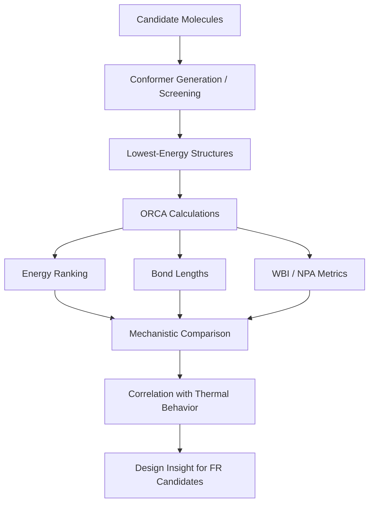

# Flame-Retardant Materials Case Study

## Project Focus

This case study highlights computational work on phosphorus-containing flame-retardant systems relevant to polymer materials. The emphasis is not just on running DFT calculations, but on extracting chemically meaningful descriptors and linking them to decomposition trends, onset behavior, and char formation.

## Problem

Can atomistic calculations help explain why different substituents in phosphorus-containing flame-retardant candidates lead to different thermal decomposition behavior and char yields?

## What Was Done

- Screened and ranked multiple conformers across melamine- and p-phenylenediamine-derived families.
- Identified lowest-energy candidate structures for deeper analysis.
- Extracted bond metrics, Wiberg bond indices, and energy trends from ORCA outputs.
- Compared computational descriptors with experimental thermal behavior summarized from TGA-related data.
- Used the resulting trends to build a mechanistic interpretation of substituent effects in flame-retardant performance.

## Representative Technical Evidence

- `all_energies_report.txt` shows ranked conformer energies across multiple chemical families.
- `tga_npa_wbi_bondlength_insights.txt` ties bond metrics to onset temperature and char behavior.
- Python utilities in the source workspace support spectra plotting, bond-length extraction, and molecular rendering.

## Included Technical Artifacts

```text
flame-retardants/
├── code/
│   ├── conformer_split.py
│   ├── measure_bond_lengths.py
│   └── plot_orca_freq_like_gaussian.py
├── data/
│   ├── all_energies_report.txt
│   └── tga_npa_wbi_bondlength_insights.txt
└── inputs/
    ├── melamine_1.inp
    └── melamine_1.slurm.sh
```

### What Is Included

- `inputs/melamine_1.inp`
  Representative ORCA input for a flame-retardant candidate workflow.
- `inputs/melamine_1.slurm.sh`
  Example batch submission script for running an ORCA job in a cluster environment.
- `code/conformer_split.py`
  Utility for managing conformer-level workflows and file organization.
- `code/measure_bond_lengths.py`
  Python analysis script for extracting chemically meaningful bond metrics from ORCA outputs.
- `code/plot_orca_freq_like_gaussian.py`
  Script for turning vibrational output into publication-style spectral plots.
- `data/all_energies_report.txt`
  Ranked conformer energies used for candidate selection.
- `data/tga_npa_wbi_bondlength_insights.txt`
  Mechanistic interpretation linking DFT descriptors with decomposition trends.

## Key Insight

The most interesting structure-property trend from this workflow is that aryl substitution appears to favor condensed-phase stabilization and char formation, while alkyl substitution tends to increase onset temperature but produces less residue. The value of the computational workflow is that it provides bond-level and electronic-structure context for those trends, rather than stopping at empirical observation.

## Analysis Flow



## Source-to-Insight Examples

### Conformer Ranking

Energy-ranked outputs show that each candidate family contains a spread of conformers, making conformer selection a real methodological step rather than a cosmetic one. This matters for downstream mechanistic interpretation.

### Bond Metrics and Thermal Behavior

The analysis notes in the source workspace point to useful heuristics:

- shorter, stronger P-O(ester) behavior tracks with higher onset and lower char
- aryl-containing systems show more multi-step decomposition and greater residue
- DFT descriptors can support predictions even for candidates lacking full experimental datasets

## Why This Matters for a Computational Chemistry Portfolio

This project demonstrates more than software familiarity:

- quantum-chemical reasoning
- chemically informed descriptor selection
- mechanistic interpretation
- simulation-to-experiment correlation
- ability to turn raw outputs into materials insight

## Selected Visuals (only parts of the full molecules are shown)


## Core Competencies Demonstrated

- Integrating atomistic simulation with macroscopic thermal analysis
- Extracting robust, chemically intuitive descriptors from quantum-chemical data
- Designing simulation strategies to address targeted materials science questions
